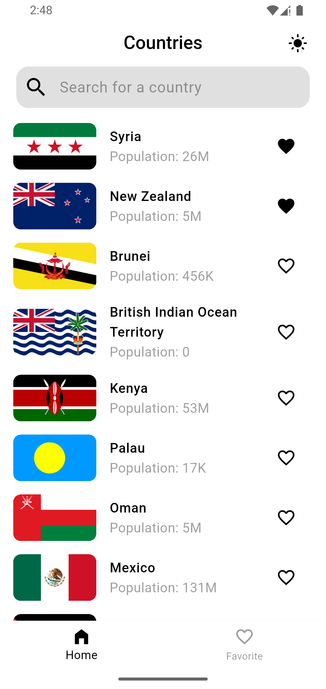
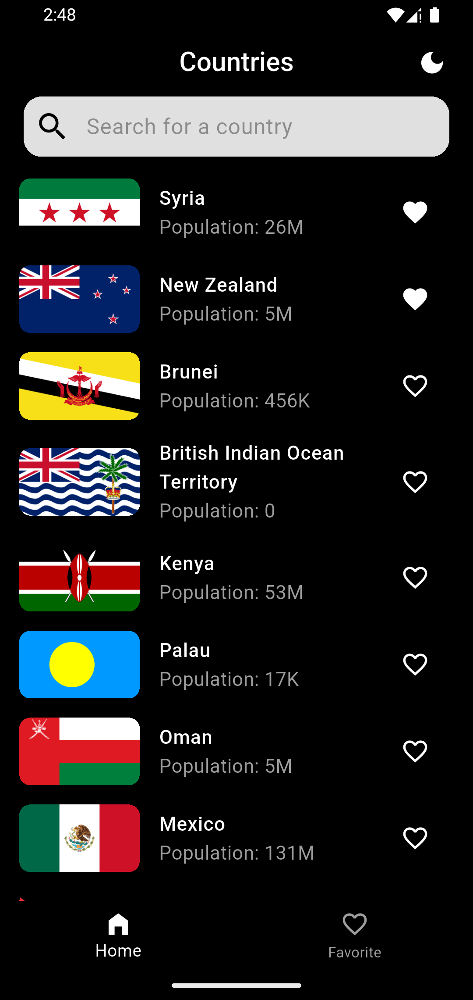
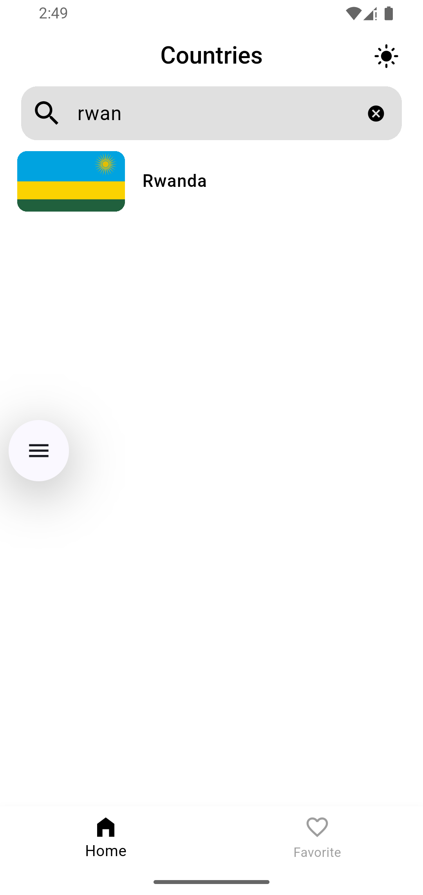
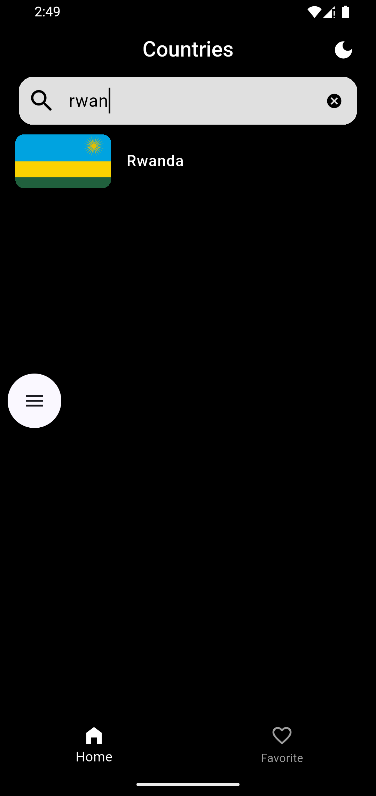
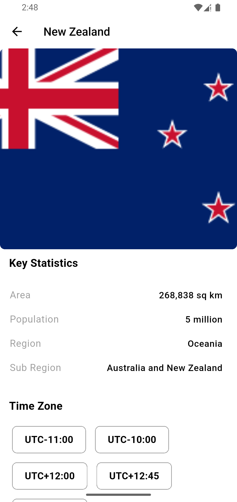
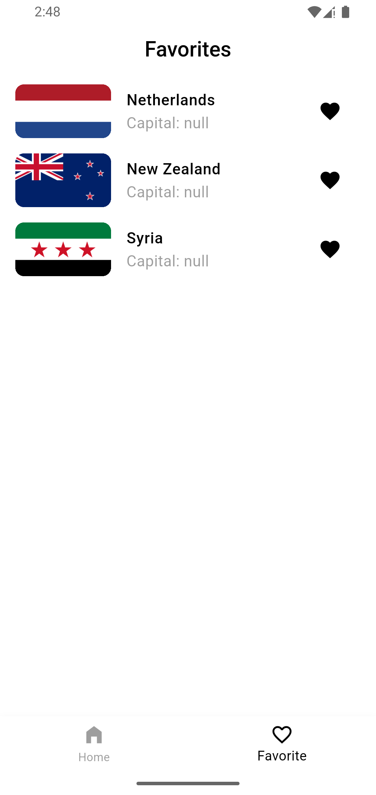
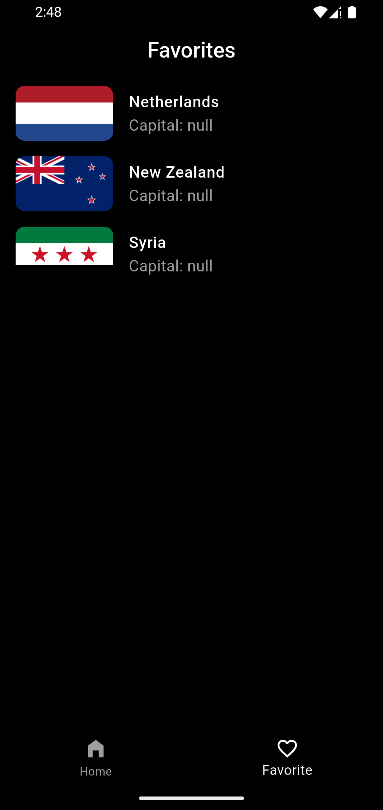

# Countries App

A Flutter application that displays country data with offline support using Hive, API integration with Dio, and state management with Cubit (Bloc). Users can search for countries, view details, and save favorites.

## Screenshots

### Home Page
<table>
  <tr>
    <td></td>
    <td></td>
  </tr>
</table>

### Search Page
<table>
  <tr>
    <td></td>
    <td></td>
  </tr>
</table>

### Country Details
<table>
  <tr>
    <td></td>
    <td></td>
  </tr>
</table>

### Favorites Page
<table>
  <tr>
    <td></td>
    <td></td>
  </tr>
</table>


---

## Table of Contents

- [Features](#features)  
- [Requirements](#requirements)  
- [Setup](#setup)  
- [Environment Variables](#environment-variables)  
- [Architecture & Technology](#architecture--technology)  

---

## Features

- List all countries with flag, population, and name  
- Search countries by name with real-time filtering  
- View detailed information for each country  
- Favorite countries locally with Hive persistence  
- Offline support using cached data in Hive  
- Light/Dark mode toggle  
- Cached network images for offline viewing  

---

## settings I used

- **Flutter:** 3.38.0
- **Dart:** 3.10.0 
- **Java:** JDK 25

---

## Setup

1. **Clone the repository**

```bash
git clone https://github.com/ad-ng/countries_app.git
cd countries_app
```

2. **Install dependencies**

```bash
flutter pub get
```

## Environment Variables
Create a .env file in the root of the project:

```bash
BASEURL='https://restcountries.com'
KEYSTORE_PATH=
KEYSTORE_PASSWORD=
KEY_ALIAS=
KEY_PASSWORD=
```
- BASEURL → The base URL for the REST Countries API
- Keystore variables → Needed for building a signed Android release APK
 
## Architecture & Technology

This project follows **Clean Architecture** principles with a clear separation of concerns while leveraging modern Flutter technologies.

- **Presentation Layer**  
  - Handles UI and state management.  
  - **Technologies:** Flutter Widgets, Cubit/Bloc, GoRouter, Material 3, light/dark mode toggle.

- **Domain Layer**  
  - Encapsulates business logic and core entities.  
  - **Technologies:** Plain Dart entities (`CountrySummary`, `CountryDetails`), use cases (`GetAllCountries`, `SearchCountriesByName`, `GetOneCountry`).

- **Data Layer**  
  - Responsible for fetching and caching data.  
  - **Remote:** `CountryApiService` using **Dio** with interceptors and custom error handling.  
  - **Local:** `CountryHiveService` using **Hive** for offline persistence.  
  - **Repository:** Combines remote and local sources.

- **Core / Shared Layer**  
  - Provides shared utilities and app-wide services.  
  - **Technologies:** `DioService`, `ThemeCubit`, error handling models, utility functions.

- **Caching & Offline Support**  
  - **Technologies:** Hive for local storage, `cached_network_image` for offline flag caching.

